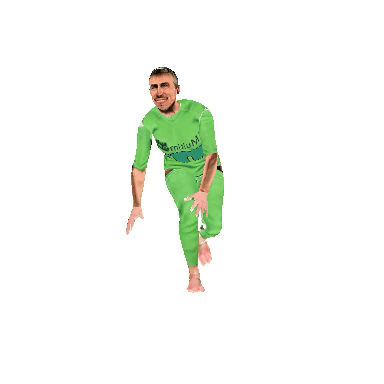

# UVMap-ID: A Controllable and Personalized UV Map Generative Model

Weijing Wang $^\star$, [Jichao Zhang](https://scholar.google.com/citations?user=SPEECTIAAAAJ&hl=en) $^\star$ $^\dagger$, 
Chang Liu, [Xia Li](https://xialipku.github.io/), [Xingqian Xu](https://scholar.google.com/citations?user=s1X82zMAAAAJ&hl=en&oi=ao), 
[Humphrey Shi](https://www.humphreyshi.com/), [Nicu Sebe](http://disi.unitn.it/~sebe/), [Bruno Lepri](https://scholar.google.com/citations?user=JfcopG0AAAAJ&hl=en&oi=ao)<br>
$\star$: Equal Contribution, $\dagger$: Corresponding Author <br>

Abstract: Recently, diffusion models have made significant strides in synthesizing realistic 2D human images based on provided text prompts. Building upon this, researchers have extended 2D text-to-image diffusion models into the 3D domain for generating human textures (UV Maps). 
However, some important problems about UV Map Generative models are still not solved, i.e., how to generate personalized texture maps for any given face image, and how to define and evaluate the quality of these generated texture maps. 
To solve the above problems, we introduce a novel method, UVMap-ID, which is a controllable and personalized UV Map generative model. Unlike traditional large-scale training methods in 2D, we propose to fine-tune a pre-trained text-to-image diffusion model which is integrated with a face fusion module for achieving ID-driven customized generation. 
To support the finetuning strategy, we introduce a small-scale attribute-balanced training dataset, including high-quality textures with labeled text and Face ID. 
Additionally, we introduce some metrics to evaluate the multiple aspects of the textures. Finally, both quantitative and qualitative analyses demonstrate the effectiveness of our method in controllable and personalized UV Map generation. 

## [Paper](https://arxiv.org/abs/2404.14568) | [Video Youtube](https://www.youtube.com/watch?v=KCHUWPtBe9o)


 Dilireba            |         Guofucheng         |  Bengio 
:-------------------------:|:--------------------------:|:-------------------------:
  |  |  

## Results

 CVers as ID            |             Celebrites as ID             
:-------------------------:|:----------------------------------------:|
  |  | 

## Rendering

 ID            |           UV Map           |  SMPL render 
:-------------------------:|:--------------------------:|:-------------------------:
  |  |  


## Environments

```
conda create -f environment.yml
```
Note: the important package is diffusers

### Pretrained Model
You can download [Unet](https://drive.google.com/file/d/1jSDWlQ9Gc7rO2Er0fu0Re175Oiv7cVDb/view?usp=sharing) and [VAE](https://drive.google.com/file/d/1c7QQGw4D_Gkp00YZlRoP1KOcEuqDsDet/view?usp=sharing)

### Test

```
export MODEL_NAME="./unet"
export VAE_MODEL_PATH="./sd-vae-ft-mse"
export OUTPUT_DIR="./output"

celebrities=(
"feifei li"
"mi yang"
"yuanyuan gao"
)
text_prompt=(
        # "blonde hair"
        # "bald head"
        # "wearing colorful shirt"
        # "wearing military soldier costume"
        # "wearing white top, blue pants, glasses"
        # "wearing white shirt, jeans, glasses"
        # "wearing white shirt, jeans, white hat"
        "is superhero"
        # "wearing bussiness suit"
        # "is policeman custom"
        # "is santa claus costume"
        # "wearing red clothes"
        # "wearing blue clothes"
        # "wearing casual suits"
        # "bald head"
        # "wearing green clothes"
        # "wearing black clothes"
        # "wearing white shirt and jeans"
        # "is military soldier costume"
        # "wearing sunglasses"
        # "wearing santa claus costume"
        # "wearing blue clothes"

)

for cele in "${celebrities[@]}"; do
for prompt in "${text_prompt[@]}"; do

        python test.py --pretrained_model_name_or_path=$MODEL_NAME  \
                --vae_model_name_or_path=$VAE_MODEL_PATH \
                --output_path=$OUTPUT_DIR  \
                --instance_prompt="a sks texturemap of asian woman $prompt"  \
                --resume_ckpt 1500 \
                --num_inference_steps 50 \
                --guidance_scale 5 \
                --validation_images "./test/$cele/1.jpg" \
                --validation_image_embeds "./test/$cele/1.npy" \

done
done
```

### Citation

```
@article{wang2024uvmap,
  title={UVMap-ID: A Controllable and Personalized UV Map Generative Model},
  author={Wang, Weijie and Zhang, Jichao and Liu, Chang and Li, Xia and Xu, Xingqian and Shi, Humphrey and Sebe, Nicu and Lepri, Bruno},
  journal={ACM MM},
  year={2024}
}
```